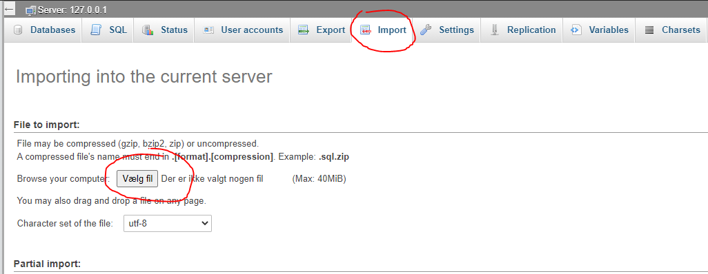

# Chinook Abridged


Chinook Abridged is a cloud-deployed full-stack secure web application with token authentication and a RESTful API.

  - Final Mandatory Assignment for web development
  - See installation guide to view the project
  - Deployed to AWS: Link may not work since the instance may have been taken down.
    http://chinook-deploy-dev.us-east-1.elasticbeanstalk.com
  - Read "Final Mandatory Assignment.pdf" for more information about the project.
  - API documentation is inside the DOC folder - some information is missing.

### Tech

Chinook Abridged Tech Stack.

* [PHP] - server side scripting language - primarily used to fecth data from database!
* [HTML] - Markdown.
* [CSS] - Styling HTML
* [Javascript] - Client side scripting
* [apidoc](https://apidocjs.com/) - API documentation creator

### Installation

Chinook requires [XAMPP](https://www.apachefriends.org/index.html/) Or another web server where PHP can be executed.

The installation guide will be based on XAMPP and Windows system.


1. Start with making a folder in "htdocs" called Chinook

```sh
$ cd C:\xampp\htdocs
$ mkdir Chinook
```
2. Copy and paste this project files and folder into "Chinook"

3. Start MySQL server and open: "http://localhost/phpmyadmin/server_import.php" in your browser

4. Import the SQL file and execute. If successful, you should have a database called "chinook_abridged".


5. Navigate to views/helper/url.js and change the "root" variable to "http://localhost/chinook".

### Todos

 - Write MORE Tests
 - Add Night Mode

License
----

MIT


**Free Software, Hell Yeah!**
